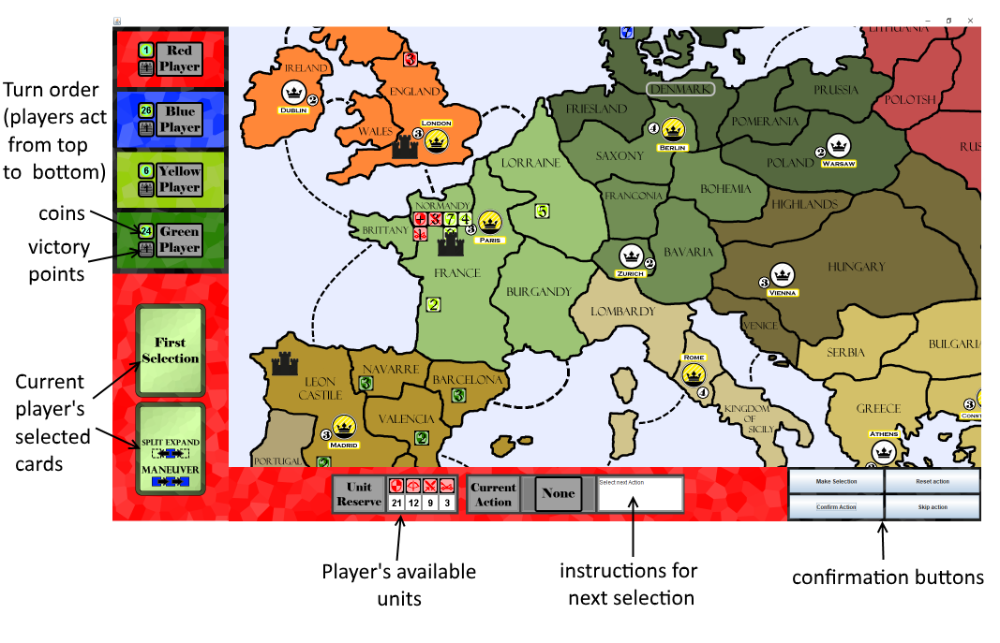

# RiskEurope
This application is a full implementation of the board game "Risk Europe" using Java and Java Swing. This project was created as a student project during summer 2017.

### Goals
This was my first "large" program, and the first program I completed outside of the classroom. As such, when I set out to complete this, I had an extremely limited understanding of how object-oriented programming worked, with a faint understanding of inheritance and no concept of polymorphism. My goals for this project were to:
- complete my first working program outside of school
- understand how objects could communicate with each other on a larger scale
- learn how to create a GUI
- seperate the GUI layer from the model layer

### Future Plans
As my skills have improved dramically over the last year, I want to return to this program and completely overhaul it, applying the knowledge I have gained from more recent projects. Depending on the time I have available, there are a few options I may pursue
- refactor the application to adhere to SOLID principles and the MVVM design methodology
- keep the game as a desktop application, but allow players to join a single game online (instead of having all players use a single application on the same computer)
- turn the program into a web application using Angular and NodeJS with a Java Spring backend

## Installation
To install, download and extract the files to the desired location, then launch the "RiskEuropeGame-0.0.1...." jar file located in the "install" folder.

## Tutorial

### The Rules
This game follows the rules of Risk Europe, which can be found [here](https://www.hasbro.com/common/documents/430e4f3f6bfd10148a8ef35124427085/D74F1A6B50569047F518FD99447BA643.pdf).

### The GUI

#### Selecting Cards
Each round, each player selects two cards they will play from a pop-out window. The first card selected will be highlighted with the "First Selection" marker, and the second will have "Second Selection". The player can continue clicking to adjust the first and second selections as needed. When the correct cards are selected in the desired order, hit "Confirm" to advance to the next player. These cards will be played in the first and second cycles of play in a round, respectively.

#### Selecting an Action To Perform
Twice each round, each player will complete an action (and possibly an additional free action) from one of their cards, with the first round using the first card, and the second round using the second card. To select an action, select one of the highlighted options on the current player card and click "Make Selection". *(Note: when a card has an optional action on it, that action must be selected at some point in the players turn. If the player wishes to complete the action, select the options as instructed. If the player wishes to not take the action, select the action, select "make selection" to confirm it, and then select "skip action")*

#### Completing an Action
The action indicator will instruct you on the proper set of steps to take to complete an action. For example, to complete the "expand" action, you will be instructed first to select a territory to move from, then to select the units to move, then the territory to move into. Once all steps have been completed, select "Confirm Action". If you want to reset all the steps, select "Reset Action". If you want to not complete an action but advance your turn, select "Skip Action". 

##### Selecting a Territory
To select a territory, first click one of the highlighted options on the map and then click "Make Selection".

##### Selecting Units to Move or Place
When a player needs to move/place units, a small window will appear. Use the dropdowns to choose how many of each unit to move/place, and then hit "Confirm Selection"

##### Purchasing Units
When a player decides to purchase new units, a unit menu will pop up and display the name, traits, and cost of each unit. Select the desired number of each from using the dropdowns and use "Confirm Purchase" to confirm.

##### Territory Tax Collection
When collecting tax, once a territory is selected, gold coins will apear over each appropriate territory to indicate the amount the player will gain from that territory if confirmed.

#### Performing Combat
At the end of a round, if any territory contains units from multiple players, a round of combat will occur. When combat occurs, a new window will pop out, and the player will be able to view the units, dice, and other information of each player involved.For each round of combat, each side must roll dice as appropriate by selecting "Roll Dice". THe results will be indicated on the screen, and if any hits are scored, select "Select Casualties" to choose the units to remove.

##### Selecting Casualties
When casualties are selected, a new panel will appear, displaying the number of units the player must remove. Choose units with the dropdowns until enough are selected for removal, then hit "Confirm".
